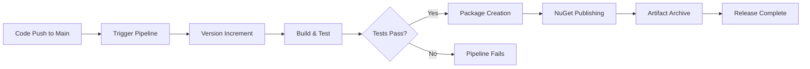

# Release Process

The CLOOPS NATS SDK uses a fully automated CI/CD pipeline for version management and NuGet package publishing. This document outlines the release workflow, versioning strategy, and troubleshooting procedures.

## 🚀 Automated Release Workflow

### Overview

The release process is designed to be hands-off and reliable, automatically handling versioning, building, testing, and publishing whenever code changes are merged to the main branch.

### Release Triggers

Releases are automatically triggered when: **Code is merged to `main` branch** - Primary release trigger

### Pipeline Stages

## 📋 Version Management Strategy

Completely controlled by build pipeline env variables

### Version Components

| Component | Description             | Management          |
| --------- | ----------------------- | ------------------- |
| **Major** | Always fixed            | Manual increment    |
| **Minor** | Always fixed            | Manual increment    |
| **Build** | Continuous build number | Automatic increment |

> As a philosophy, all events, messages and subjects are always backward compatible. A new SDK version always \*adds\*\* new events, messages never modifies existing events and messages, unless deprecation is authorized confirming absolutely no one is using old payload

## 📦 NuGet Package Management

### Package Information

- **Package ID**: `cloops.nats`
- **Target Framework**: .NET 9.0+
- **Dependencies**: Automatically managed via .csproj files
- **Package Repository**: NuGet.org (public) or private feed

### Package Contents

Each published package includes:

- **SDK Libraries**: Compiled .NET assemblies
- **XML Documentation**: IntelliSense support for consumers
- **Dependencies**: Referenced packages and versions
- **Metadata**: Package description, authors, license information

## Consumer patterns

> Since all versions are backward compatible, consumers should always stay on latest version of SDK.
