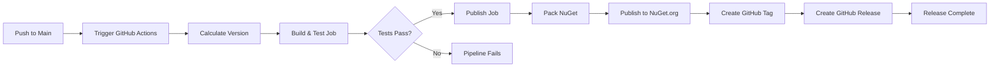

# Release Process

The CLOOPS NATS SDK uses a fully automated CI/CD pipeline for version management and NuGet package publishing. This document outlines the release workflow, versioning strategy, and troubleshooting procedures.

## 🚀 Automated Release Workflow

### Overview

The release process is designed to be hands-off and reliable, automatically handling versioning, building, testing, and publishing whenever code changes are pushed to the main branch. The workflow is implemented using GitHub Actions and runs automatically on every push to `main`.

### Release Triggers

Releases are automatically triggered when: **Code is pushed to `main` branch** - Primary release trigger

The workflow consists of two jobs:

1. **Build Job**: Builds the project, runs tests, and validates the code
2. **Publish Job**: Creates NuGet package, publishes to NuGet.org, creates GitHub tag, and creates GitHub release

### Pipeline Stages

## 📋 Version Management Strategy

Version management is completely controlled by GitHub Actions workflow environment variables defined in `.github/workflows/ci.yml`.

### Version Format

The version follows the semantic versioning pattern: `MAJOR.MINOR.BUILD`

Where:

- **MAJOR**: Defined in workflow env as `MAJOR` (currently `1`)
- **MINOR**: Defined in workflow env as `MINOR` (currently `1`)
- **BUILD**: Automatically set to `github.run_number` (GitHub Actions run number)

**Example**: If `MAJOR=1`, `MINOR=1`, and the workflow run number is `42`, the resulting version will be `1.1.42`.

### Version Components

| Component | Description               | Management                                              |
| --------- | ------------------------- | ------------------------------------------------------- |
| **Major** | Major version number      | Manual update in `.github/workflows/ci.yml` env section |
| **Minor** | Minor version number      | Manual update in `.github/workflows/ci.yml` env section |
| **Build** | GitHub Actions run number | Automatic (increments with each workflow run)           |

### Updating Version

To update the major or minor version:

1. Edit `.github/workflows/ci.yml`
2. Update the `MAJOR` or `MINOR` values in the `env` section (lines 11-12)
3. Commit and push to `main`
4. The next workflow run will use the new version numbers

> As a philosophy, all events, messages and subjects are always backward compatible. A new SDK version always \*adds\*\* new events, messages never modifies existing events and messages, unless deprecation is authorized confirming absolutely no one is using old payload

## 📦 NuGet Package Management

### Package Information

- **Package ID**: `cloops.nats`
- **Target Framework**: .NET 9.0+
- **Dependencies**: Automatically managed via .csproj files
- **Package Repository**: NuGet.org (public feed)
- **API Key**: Stored as GitHub secret `NUGET_API_KEY`

### Publishing Process

The publish job automatically:

1. Calculates the package version using the workflow's version strategy
2. Builds the project in Release configuration
3. Creates the NuGet package (`.nupkg` file)
4. Uploads the package as a build artifact
5. Publishes to NuGet.org using the stored API key
6. Skips duplicate packages if the same version already exists

### Package Contents

Each published package includes:

- **SDK Libraries**: Compiled .NET assemblies
- **XML Documentation**: IntelliSense support for consumers
- **Dependencies**: Referenced packages and versions
- **Metadata**: Package description, authors, license information

## 🏷️ GitHub Release Management

### Automatic Tag Creation

After successfully publishing to NuGet, the workflow automatically:

1. Creates a Git tag in the format `v{version}` (e.g., `v1.1.42`)
2. Tags the commit that triggered the workflow
3. Skips tag creation if the tag already exists (idempotent)

### Automatic Release Creation

The workflow also automatically creates a GitHub Release:

- **Tag**: Uses the version tag created above
- **Title**: `Release v{version}`
- **Body**: Includes version, build number, and commit SHA
- **Status**: Published (not draft or prerelease)
- **Idempotent**: Skips creation if release already exists

The release notes are automatically generated and include:

- Version number
- Build number (GitHub Actions run number)
- Commit SHA that triggered the release

## Consumer patterns

> Since all versions are backward compatible, consumers should always stay on latest version of SDK.
